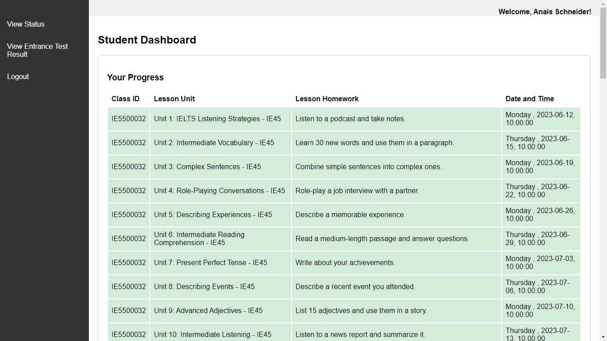

# 🎓 English Centre Management: Student Web View ✨

Welcome to the **STUDENT\_WEB\_VIEW**, a handy website designed to help students at our English center stay on top of their studies! 🚀 This platform allows you to easily track your schedule, review lessons, check your class status, and even view your entrance test results.

Authors:  [Hoang Yen Nhi](https://github.com/ryhoangf), [Nguyen Hoang Phuc](https://github.com/LeMaoJames/LeMaoJames), [Phan Hoang Hai](https://github.com/ToJupiter)

## 🛠️ How to install

Let's get you set up! Follow these simple steps:

1. **✅ NodeJS & PostgreSQL:**  Make sure you have both NodeJS and PostgreSQL installed and properly configured on your computer. If you don't have them, you can easily find installation guides online!
2. **📥 Clone the Repository:** Open your terminal or command prompt and type in the following commands:

    ```sh
    https://github.com/ToJupiter/EnglishCenterManagement
    cd student_view
    ```
    This will download the project files to your computer and navigate you into the project directory.
3. **💾 Create the Database:**

    ```sh
    psql -U postgres -c "CREATE DATABASE TTTA;"
    ```
    This command creates a new database named `TTTA`. After creating the database, run the SQL file provided in the project to set up the necessary tables.
4. **📦 Install Dependencies:** Run the following command to install all the necessary packages:

    ```
    npm install
    ```
5. **⚙️ Environment Variables:** Create a file named `.env` in the root directory of the project. Add the required environment variables to this file. (You'll find a list of needed variables in the project documentation.)
6. **🏁 Start the Server:** Time to launch! Run the command:

    ```
    npm start
    ```
7. **🌐 Open in Browser:** Open your favorite web browser and go to  `http://localhost:3000`.

## 🔑  Logging In

Your student ID will be provided by the English center. However, for testing purposes, you can log in with a sample ID:

*   Use the format "STXXXX", replacing "XXXX" with any number up to **7350**.
    *   For example: `ST0001`, `ST7349`, etc.

**📸 Screenshots**




## 🌟 Credits


| Role                                  | Contributor |
| :------------------------------------ | :---------- |
| 🗄️ **Database design:**               | [Hoang Yen Nhi](https://github.com/ryhoangf), [Nguyen Hoang Phuc](https://github.com/LeMaoJames/LeMaoJames), [Phan Hoang Hai](https://github.com/ToJupiter) |
| 🏭 **Database data generation:**      |  [Nguyen Hoang Phuc](https://github.com/LeMaoJames/LeMaoJames), [Phan Hoang Hai](https://github.com/ToJupiter) |
| 🔍 **Database queries:**              | [Hoang Yen Nhi](https://github.com/ryhoangf), [Nguyen Hoang Phuc](https://github.com/LeMaoJames/LeMaoJames), [Phan Hoang Hai](https://github.com/ToJupiter) |
| 📊 **Beautiful report and presentation:** |  [Hoang Yen Nhi](https://github.com/ryhoangf) |
| 💻 **WebView design and implementation:** |  [Nguyen Hoang Phuc](https://github.com/LeMaoJames/LeMaoJames) |


We hope you enjoy using **STUDENT\_WEB\_VIEW**! If you have any questions or feedback, don't hesitate to reach out! 😊
